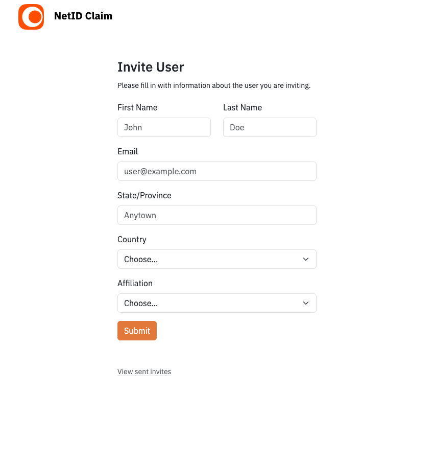
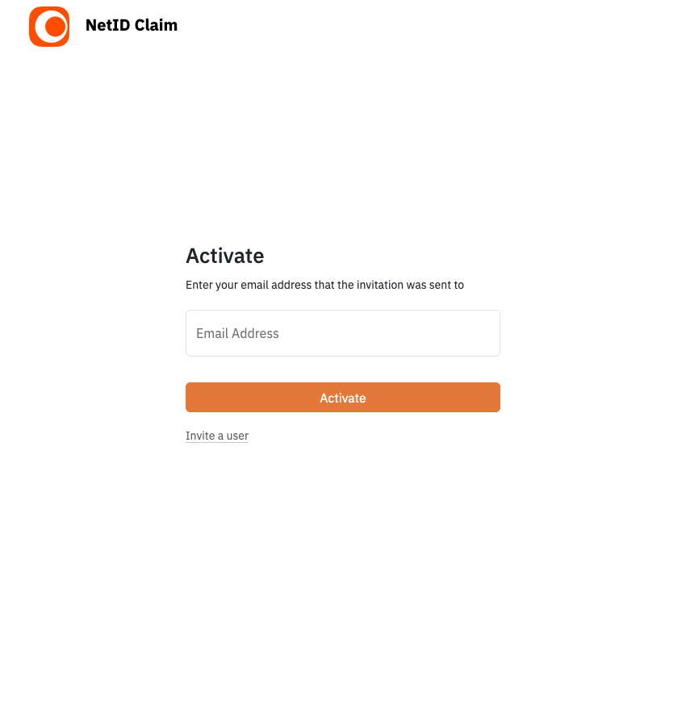
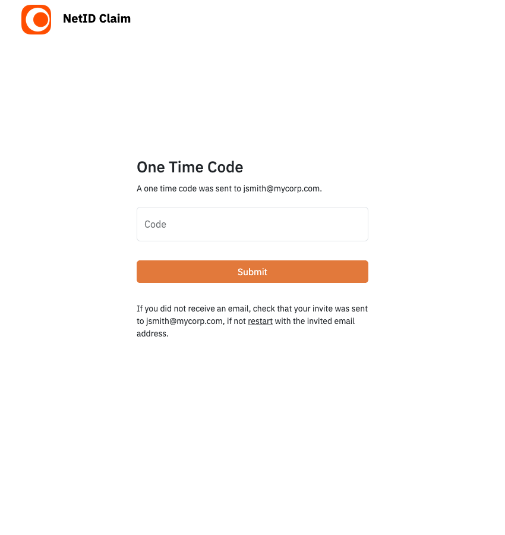
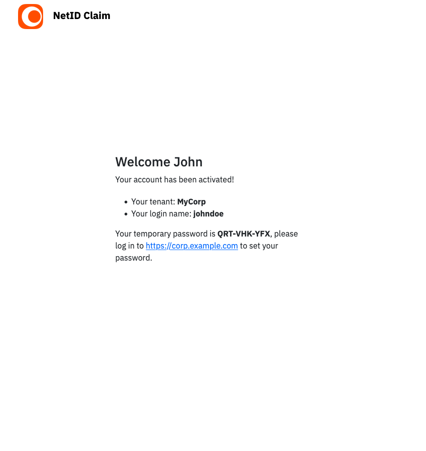

# Red Hat Identity Management Web Invitations 

 

**NetID Activate** is a Go web app that provides controlled account invitation 
and account activation via web portal. It acts as a companion to 
[Red Hat Identity Management](https://docs.redhat.com/en/documentation/red_hat_enterprise_linux/10/html/planning_identity_management/index) (Red Hat IdM) / FreeIPA.

It enables users to add accounts to a Red Hat IdM domain without needing 
[view ACI](https://docs.redhat.com/en/documentation/red_hat_enterprise_linux/8/html/configuring_and_managing_identity_management/access-control-in-idm_configuring-and-managing-idm#access-control-instructions-in-idm_access-control-in-idm), trusting the IdM integrated root certificate on browsers, or installing IdM 
with [external CA as the root CA](https://docs.redhat.com/en/documentation/red_hat_enterprise_linux/10/html/installing_identity_management/installing-an-idm-server-with-integrated-dns-with-an-external-ca-as-the-root-ca).

**NetID Activate** can be installed separately from Red Hat IdM and does not have 
run on a domain joined host. All calls to IdM are over the **[JSON-RPC](https://wikipedia.org/wiki/JSON-RPC) API**.

<!-- 850 900 -->

Here is what the web portal looks like:

    

    
    
    

## Features

- OpenID Connect authentication for users inviting new users
- Email based one time code for invited users
- Username selection from several options, options are removed if already used in IdM
    - First name + last name
    - First name three letters + last name
    - First name two letters + last name
    - First name + last name two letters
    - First initial + last name + number
- Multiple default groups for invited users  
- If the invited email is present in IdM, the inviter is notified that 
the account exists
- GECOS set to display name or `First Last (<Country Alpha3> <Affiliation>)`

## Configuration

### IdM App Account  

NetID Activate requires an account under `cn=users,cn=accounts` to authenticate 
and use the IdM JSON-RPC API. A LDAP only service account does not work. 

It is recommended that the account have a complex password policy, and 
assigned a role with custom limited permissions instead of admin. The following 
permissions are needed:

#### Add User
- Type: User
- Rights: add
- Effective attributes: gecos, pager, loginshell, givenname, manager, st, userpassword, cn, initials, sn, displayname, mail

#### Modify Group (One for each group)
- Rights: write 
- Extra target filter: `(cn=<GROUP UID>)`, `(objectclass=ipausergroup)`

#### System: Add User to default group
The default system permission

#### System: Read UPG Definition
The system permission

### Configuration File

Make a copy of [NETID.example.yaml](NETID.example.yaml) to `./NETID.yaml` or `./data/NETID.yaml`

#### Session 
`SESSION_KEY`: Set the 32 byte cookie secret key. eg `openssl rand -base64 32 | head -c 32; echo`  
`SESSION_AGE`: Optional, defaults to access token lifespan. Set the maximum age of a session before the user must reauthenticate  

#### Hostname and Port
`SERVER_PORT`: What port on localhost Go should listen to  
`SERVER_HOSTNAME`: Used in emails and OpenID Connect    
`OIDC_SERVER_PORT`: What port OpenID Connect redirect to and what users use  

#### OpenID Connect
`OIDC_WELL_KNOWN`: URI of well-known endpoint    
`CLIENT_ID`: Client ID  
`CLIENT_SECRET`: Client secret   
`SCOPES`: OIDC Scopes  

#### Data
`DB_PATH`: Relative path to db  

#### Display Images
`LOGO_URL`: Fully qualified URI to image  
`FAVICON_URL`: Fully qualified URI to favicon   

#### Display Text 
`SITE_NAME`: Shown in emails and header   
`TENANT_NAME`: Name of IdM directory, shown in emails  
`AFFILIATION`: JSON list, added to GECOS   
`LOGIN_REDIRECT`: Shown to users after successful account activation  
`LINK_SERVICE_PROVIDER`: Shown in email footer  
`LINK_PRIVACY_POLICY`: Shown in email footer  

#### Email 
`EMAIL_FROM`: Name and address  
`AWS_REGION`: AWS  
`AWS_ACCESS_KEY_ID`: SES Credentials  
`AWS_SECRET_ACCESS_KEY`: SES Credentials  

#### Red Hat IdM 
`CACERT_PATH`: Absolute path to CA  
`IDM_HOST`: FQDN of IdM host  
`IDM_USERNAME`: IdM Username  
`IDM_PASSWORD`: IdM Password  
`IDM_ADD_GROUP`: Comma separated groups to add all new users to (no spaces)  
`IDM_GECOS`: If set to `true` will add country and affiliation to GECOS  
`OPTIONAL_GROUPS`: YAML list of optional groups to add users to, selectable by 
inviter. Set `group_required` to `""` for all inviters to use

## License  

NetID Activate is distributed under [GNU Affero General Public License v3.0](https://www.gnu.org/licenses/agpl-3.0.txt).

